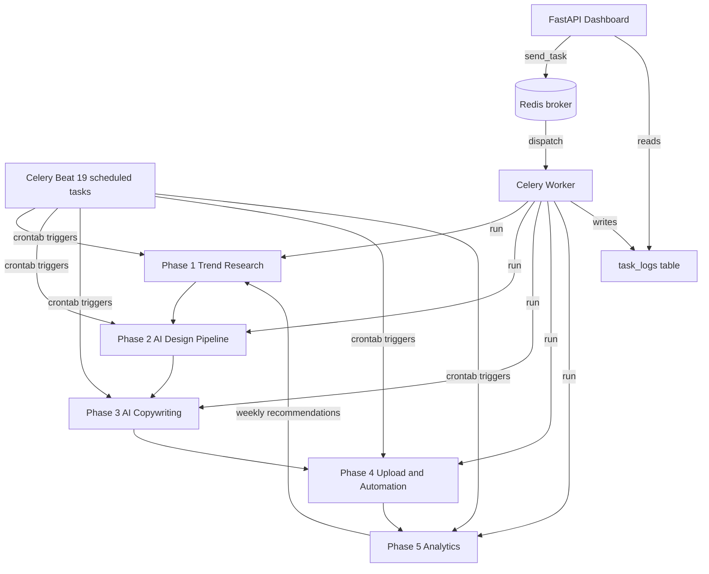
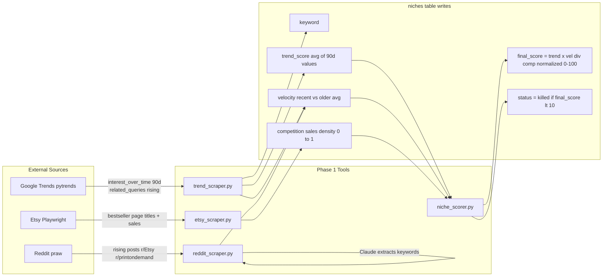
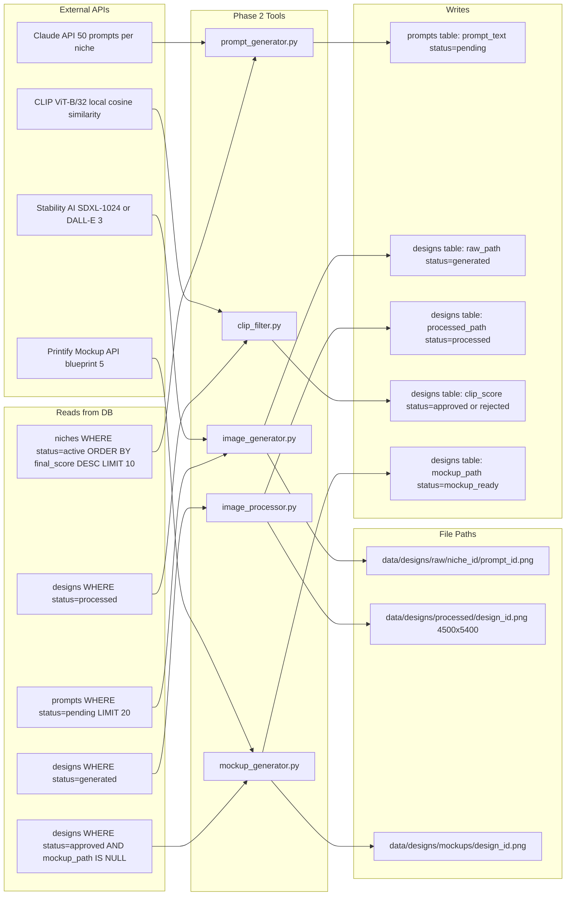
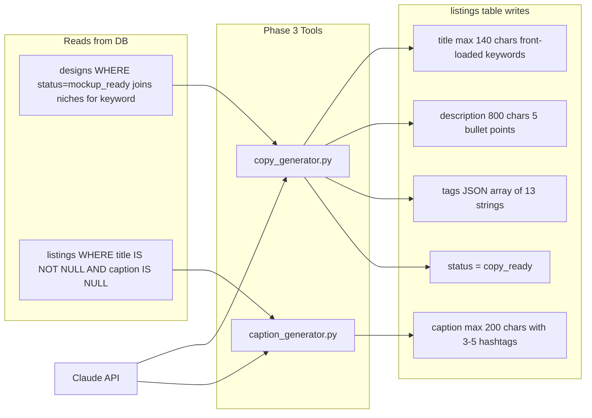
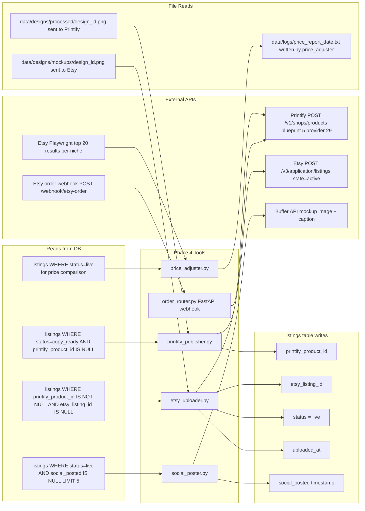
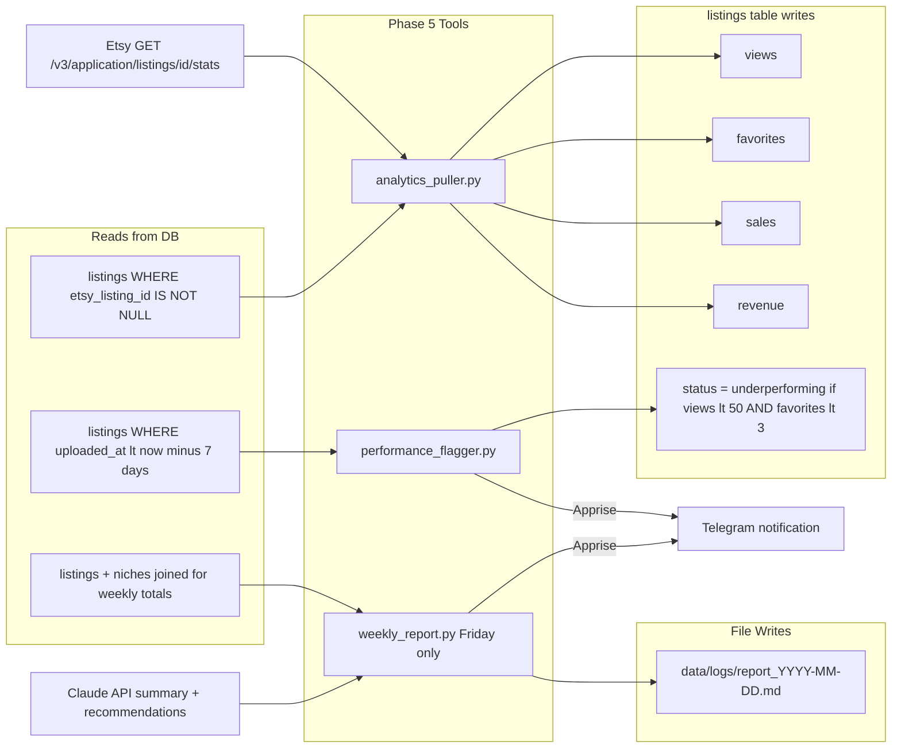
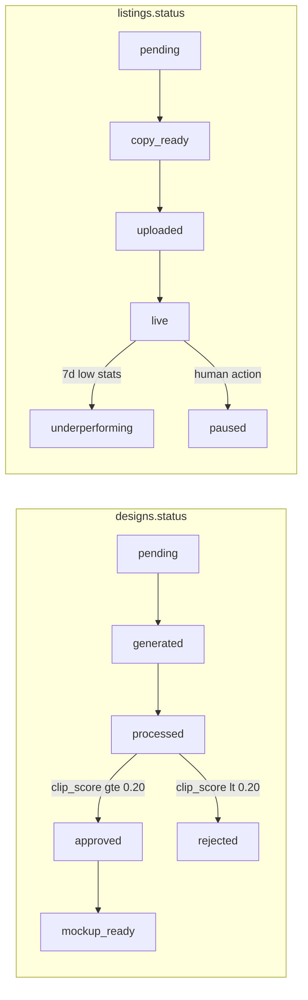

# POD Automation Dataflow Diagram

---

## Pipeline Overview

---

## Phase 1 Trend Research

Mon / Wed / Fri 00:00 to 01:00 UTC

**Log:** `data/logs/trend_scraper.log`, `data/logs/reddit_scraper.log`, `data/logs/etsy_scraper.log`, `data/logs/niche_scorer.log`

---

## Phase 2 AI Design Pipeline

Mon / Wed / Fri 02:00 to 09:30 UTC

**Log:** `data/logs/prompt_gen.log`, `data/logs/image_gen.log`, `data/logs/image_processor.log`, `data/logs/clip_filter.log`, `data/logs/mockup_gen.log`

---

## Phase 3 AI Copywriting

Mon / Wed / Fri / Sat 10:00 to 11:00 UTC

**Log:** `data/logs/copy_gen.log`, `data/logs/caption_gen.log`

---

## Phase 4 Upload and Automation

Mon to Sat 13:00 to 16:00 UTC

**Log:** `data/logs/printify_publish.log`, `data/logs/etsy_uploader.log`, `data/logs/social_post.log`, `data/logs/price_check.log`

---

## Phase 5 Analytics

Daily 20:00 UTC / Friday 20:00 UTC

**Log:** `data/logs/analytics_pull.log`, `data/logs/performance_flag.log`, `data/logs/weekly_report.log`

---

## Design and Listing Status Lifecycles

---

## Daily Schedule UTC

```mermaid
gantt
    title Automation Schedule Mon Wed Fri
    dateFormat HH:mm
    axisFormat %H:%M

    section Phase 1 Trend
    trend_scraper          :00:00, 30m
    reddit_scraper         :00:30, 30m
    niche_scorer           :01:00, 30m

    section Phase 2 Design
    prompt_generator       :02:00, 60m
    image_generator        :03:00, 180m
    image_processor        :06:00, 60m
    clip_filter            :07:00, 60m
    etsy_scraper daily     :09:00, 30m
    mockup_generator       :09:30, 30m

    section Phase 3 Copy
    copy_generator         :10:00, 60m
    caption_generator      :11:00, 30m

    section Phase 4 Upload
    printify_publisher     :13:00, 60m
    etsy_uploader          :14:00, 60m
    social_poster          :16:00, 30m

    section Phase 5 Analytics
    analytics_puller       :20:00, 30m
    performance_flagger    :20:30, 15m
    weekly_report Fri only :20:00, 30m

    section Maintenance
    price_check            :22:00, 30m
    backup Sun only        :22:30, 15m
```

---

## Data Artifacts per Phase

| Phase | Tool | Reads | Writes DB | Writes Files |
|-------|------|-------|-----------|--------------|
| 1.1 | trend_scraper | `config.SEED_KEYWORDS` | `niches.keyword` `niches.trend_score` `niches.velocity` | `data/logs/trend_scraper.log` |
| 1.2 | reddit_scraper | Reddit API | `niches.velocity` | `data/logs/reddit_scraper.log` |
| 1.3 | etsy_scraper | Etsy bestseller pages | `niches.competition` | `data/logs/etsy_scraper.log` |
| 1.4 | niche_scorer | `niches` all rows | `niches.final_score` `niches.status` | `data/logs/niche_scorer.log` |
| 2.1 | prompt_generator | `niches` top 10 by `final_score` | `prompts.prompt_text` `prompts.status=pending` | `data/logs/prompt_gen.log` |
| 2.2 | image_generator | `prompts` where `status=pending` limit 20 | `designs.raw_path` `designs.status=generated` | `data/designs/raw/<niche_id>/<prompt_id>.png` |
| 2.3 | image_processor | `designs` where `status=generated` | `designs.processed_path` `designs.status=processed` | `data/designs/processed/<design_id>.png` |
| 2.4 | clip_filter | `designs` where `status=processed` | `designs.clip_score` `designs.status=approved/rejected` | `data/logs/clip_filter.log` |
| 2.5 | mockup_generator | `designs` where `status=approved` | `designs.mockup_path` `designs.status=mockup_ready` | `data/designs/mockups/<design_id>.png` |
| 3.1 | copy_generator | `designs` where `status=mockup_ready` | `listings.title` `listings.description` `listings.tags` `listings.status=copy_ready` | `data/logs/copy_gen.log` |
| 3.2 | caption_generator | `listings` where `caption IS NULL` | `listings.caption` | `data/logs/caption_gen.log` |
| 4.1 | printify_publisher | `listings` where `status=copy_ready` | `listings.printify_product_id` | `data/logs/printify_publish.log` |
| 4.2 | etsy_uploader | `listings` where `printify_product_id` set | `listings.etsy_listing_id` `listings.status=live` `listings.uploaded_at` | `data/logs/etsy_uploader.log` |
| 4.3 | order_router | Etsy webhook payload | Printify fulfillment via API | `data/logs/order_router.log` |
| 4.4 | price_adjuster | `listings` where `status=live` | none (read-only) | `data/logs/price_check.log` |
| 4.5 | social_poster | `listings` where `status=live` limit 5 | `listings.social_posted` | `data/logs/social_post.log` |
| 5.1 | analytics_puller | Etsy stats API per `etsy_listing_id` | `listings.views` `listings.favorites` `listings.sales` `listings.revenue` | `data/logs/analytics_pull.log` |
| 5.2 | performance_flagger | `listings` where `uploaded_at` older than 7d | `listings.status=underperforming` | `data/logs/performance_flag.log` |
| 5.3 | weekly_report | `listings` + `niches` joined aggregates | none | `data/logs/report_YYYY-MM-DD.md` |
